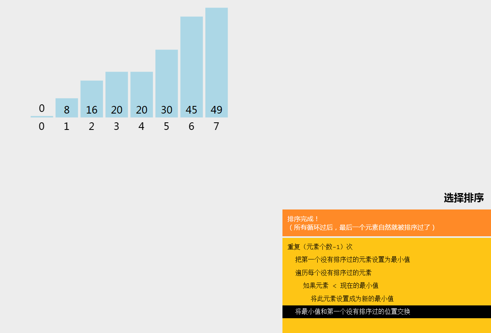

## 排序

### 冒泡排序

#### 总结:

==基本概念:==             ==套路写法:==		==如何优化:==
两两相邻		  两层循环		 1,比过不比
不停比较		  外层轮次 		2.加入bool
不断交换		  内层比较
比较n轮		    两值比较
			         满足交换

#### 排序的基本概念

排序是计算机内经常进行的一种操作 其目的是**将一组"无序"**的记录序列**调整为"有序"**的记录序列
==常用的排序列子==
8 7 1 5 4 2 6 3 9
将上面的这个无序序列 **变成 有序(**升序或降序)序列的过程
1 2 3 4 5 6 7 8 9
9 8 7 6 5 4 3 2 1

在程序中 序列**一般 存储在数组当中**
所以 排序往往是对 数组进行排序

```c#
int[] arr = new int[] { 8, 7, 1, 5, 4, 2, 6, 3, 9 };
```

把数组里面的内容变为有序的

#### 冒泡排序的基本原理

两两比较
不停比较
不停交换
比较n轮


#### 代码实现

##### 第一步

**如何比较**数组中的两组**相邻的数**
8 7 1 5 4 2 6 3 9
从头开始
**第i个数** 和 **第n+1个数** 比较
==数组==是从0开始计算的 而==数组长度==是从1开始的 所以arr.Length需要 - 1

```c#
for (int i = 0; i < arr.Length-1; i++)//进一次循环就比较一轮
{
    //如果 第i个数 比第i+1个数大 那他们就要交换位置
    if (arr[i] > arr[i+1])
    {
        //第二步 交换位置
        //中间商 temp
        int temp = arr[i];
        arr[i] = arr[i+1];
        arr[i+1] = temp;
    }
}
```

##### 第三步

然后交换n轮?
有几个数(**数组长度**) 就交换多少轮

```c#
for (int n = 0;n < arr.Length;n++) 
{
     //进一次循环就比较一轮
     for (int i = 0; i < arr.Length-1; i++)
     {
         //如果 第i个数 比第i+1个数大 那他们就要交换位置
         if (arr[i] > arr[i + 1])
         {
             //第二步 交换位置
             //中间商 temp
             int temp = arr[i];
             arr[i] = arr[i + 1];
             arr[i + 1] = temp;
         }
     }
}
```

##### 第四步 优化

1.**确定**位置**的数字** **就不用在比较了**
确定了一轮 极值(最大或者最小) 已经放到对应位置了(往后放)
所以 **每完成n轮 后面位置的数 就不用在参与比较了** (让里面的循环再去减去外面的循环次数 `arr.Length - 1 - n`)

```c#
for (int n = 0; n < arr.Length; n++)
{
    //进一次循环就比较一轮
    for (int i = 0; i < arr.Length - 1 - n; i++)
    {
        //如果 第i个数 比第i+1个数大 那他们就要交换位置
        if (arr[i] > arr[i + 1])
        {
            //第二步 交换位置
            //中间商 temp
            int temp = arr[i];
            arr[i] = arr[i + 1];
            arr[i + 1] = temp;
        }
    }
}
```

2.特殊情况的优化
外面**声明**一个**标识** 来**表示 该轮是否进行了交换**

```c#
bool isSort = false;//标识
for (int n = 0; n < arr.Length; n++)
{
    //每一轮开始时 默认没有进行过交换
    isSort = false;
    //进一次循环就是比较一轮
    for (int i = 0; i < arr.Length - 1 - n; i++)
    {
        //如果 第i个数 比第i+1个数大 那他们就要交换位置
        if (arr[i] > arr[i + 1])
        {
            isSort = true;
            //第二步 交换位置
            //中间商 temp
            int temp = arr[i];
            arr[i] = arr[i + 1];
            arr[i + 1] = temp;
        }
    }
    //当一轮结束过后 如果isSort这个标识 还是false
    //那就意味着 已经是最终的序列了 不需要再判断交换了
    if (!isSort)
    {
        break;
    }
}
//效果展示
for (int i = 0; i < arr.Length; i++)
{
    Console.WriteLine(arr[i]);
}
```

#### 练习题

##### 第一题:

定义一个数组 长度为20 每个元素值随机0~100的数
使用冒泡排序进行升序排序并打印
使用冒泡排序进行降序排序并打印

```c#
Console.WriteLine("随机");
int[] arr = new int[20];
Random r = new Random();
//随机值
for (int i = 0; i < arr.Length; i++)
{
    arr[i] = r.Next(101);
    Console.Write(arr[i] + " ");
}
```

```c#
bool b = false;
for (int n = 0; n < arr.Length; n++)
{
    b = false;
    for (int i = 0; i < arr.Length - 1 - n; i++)
    {
        if (arr[i] > arr[i + 1])//将> 改成 < 就是降序
        {
            b = true;
            int temp = arr[i];
            arr[i] = arr[i + 1];
            arr[i + 1] = temp;
        }
    }
    if (!b)
    {
        break;
    }
}
//效果
for (int i = 0; i < arr.Length; i++)
{
    Console.Write(arr[i] + " ");
}
```

##### 第二题:

写一个[函数](#函数) 实现一个数组的排序 并返回结果 可以根据参数决定是升序还是降序

```c#
static int[] Sort(int[] array,bool Sort) 
{
    bool b = false;
    int temp;
    Console.WriteLine("当前是"+(Sort ? "升序" : "降序"));
    

for (int n = 0; n < array.Length; n++)
{
    b = false;
    for (int i = 0; i < array.Length - 1 - n; i++)
    {
        if (Sort ? (array[i] > array[i + 1]) : (array[i] < array[i + 1]))
        {
            b = true;
            temp = array[i];
            array[i] = array[i + 1];
            array[i + 1] = temp;
        }
    }
    if (!b)
    {
        break;
    }
}
return array;

}
```

```c#
//运用函数
Sort(arr, true);

//结果
for (int i = 0; i < arr.Length; i++)
{
    Console.Write(arr[i] + " ");
}
Console.WriteLine() ;
```


---


### 选择排序

#### 总结:

==基本概念:==
新建中间商
依次比较
找出极值
放入目标位置
比较n轮

==套路写法:==
两层循环
外层轮数
内层寻找
初始索引
记录极值
内存循环外交换

#### 1.选择排序基本原理

新建中间商
依次比较
**找出极值**(最大或最小)
**放入目标位置**
比较n轮




#### 2.代码实现

实现升序 把最大值 放在最后面 

```c#
int[] arr = new[] { 10, 17, 1, 50, 14, 2, 6, 39, 90 };
```

##### 第一步

声明一个中间商 来记录索引
每一轮开始 都默认第一个数都是极值

```c#
int index = 0;
//第二步
//依次比较
for (int i = 0; i < arr.Length; i++)
{
    //第三步
    //找出极值(最大值)
    if (arr[index] < arr[i])
    {
        index = i;
    }
}
```

##### 第四步

放入 目标位置
Length - 1 -轮数
如果当前极值所在位置 就是目标位置 就没必要交换了

```c#
if (index != arr.Length - 1 - 轮数)
{
    //中间商
    int temp = arr[index];
    arr[index] = arr[arr.Length - 1 - 轮数];
    arr[arr.Length - 1 - 轮数] = temp;
}
```

##### 第五步

```c#
for (int n = 0; n < arr.Length; n++)
{
    //第一步 声明一个中间商 来记录索引
    //每一轮开始 都默认第一个数都是极值
    int index = 0;
    //第二步
    //依次比较

//arr.Length-n的目的是 排除上一轮 已经放好的位置的数
for (int i = 0; i < arr.Length - n; i++)
{
    //第三步
    //找出极值(最大值)
    if (arr[index] < arr[i])
    {
        index = i;
    }
}
//第四步 放入 目标位置
//Length - 1 -轮数
//如果当前极值所在位置 就是目标位置 就没必要交换了
if (index != arr.Length - 1 - n)
{
    //中间商
    int temp = arr[index];
    arr[index] = arr[arr.Length - 1 - n];
    arr[arr.Length - 1 - n] = temp;
}

}
//输出结果
for(int i = 0; i < arr.Length; i++)
{
    Console.Write(arr[i]+" ");
}
```


---