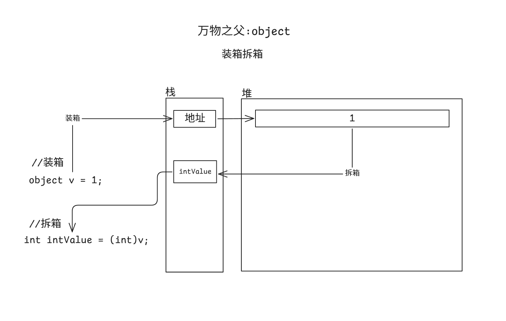

### 万物之父和装箱拆箱

#### 总结

==万物之父:==`object`
基于[里氏替换](#里氏替换)原则的 可以用`object`容器**装载一切**类型的**变量**
**它是所有类型的基类**

==装箱拆箱==
用`object`存储值类型(装箱)
把`object`里面存的值 转换出来(拆箱)

**好处:**
不确定类型时可以使用 **方便参数存储和传递**

**坏处:**
存在内存的迁移 **增加性能消耗**

不是不用 尽量少用

#### 万物之父

万物之父
关键词:`object`
==概念:==
`object` 是**所有类型的基类** 他是一个**类(引用类型)**
==作用:==
1.可以利用[[里氏替换原则]] 用`object`容器装所有对象
2.可以用来表示不确定类型 作为函数参数类型

#### 万物之父的使用

```c#
class Father
{

}
class Son : Father
{
    public void Speak()
    {
        Console.WriteLine("说话");
    }
}
```

```c#
Father f = new Son();
if(f is Son)
{
    (f as Son).Speak();//说话
}
//引用类型
object o = new Son();
//用is as 来判断和转换即可
if (o is Son)
{
    (o as Son).Speak();
}
//值类型
object o2 = 114514;
//用强转
int i = (int)o2;
//特殊的string类型
object str = "123";
string str2 = str.ToString();
str2 = str as string;

//数组
object arr = new int[10];
int[] arr2 = (int[])arr;
arr2 = arr as int[];
```

####  装箱拆箱

**发生条件**
用`object`**存值类型**(装箱)
再把`object`**转为值类型**(拆箱)

**装箱**
把**值类型用引用类型存储**
**栈内存会迁移到堆内存中**

**拆箱**
把**引用类型存储的值类型取出来**
**堆内存会迁移到栈内存中**

==好处:==不确定类型时可以**方便参数的存储和传递**
==坏处:==存在内存迁移 增加**性能消耗**

```c#
//装箱
object v = 1;
//拆箱
int intValue = (int)v;
```



**好处 如:**不确定类型时可以**方便参数的存储和传递**

```c#
static void TestFun(params object[] array)
{

}
//好处:如
TestFun(1, 2, 3, 4f, 3.5, "123", new Son());
```


----
