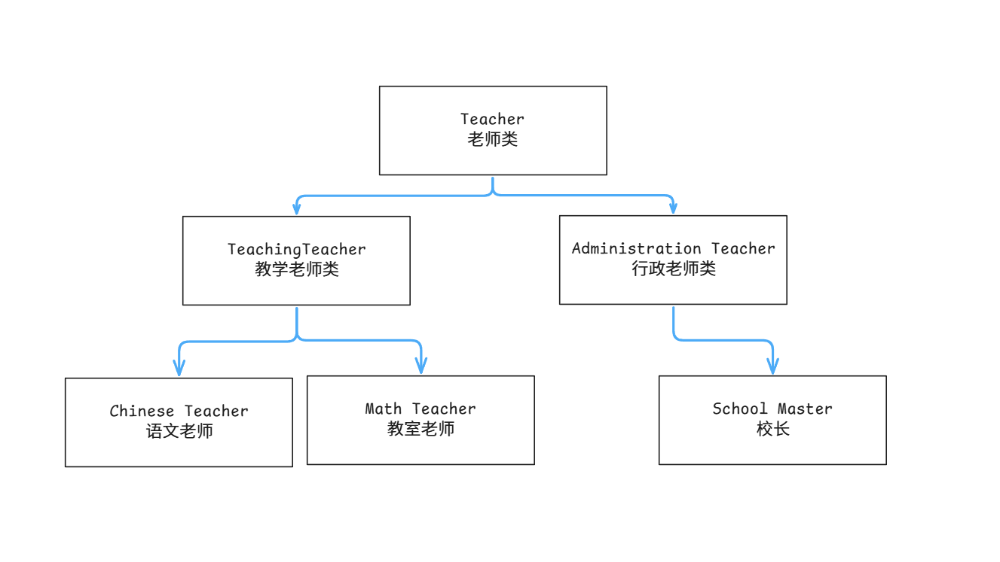

### 继承的基本规则

#### 总结:

==继承基本语法==:
class 类名 : 父类名{}
1.**单根性**:只能继承一个父亲
2.**传递性**:子类可以继承父类的父类...的所有内容
3.访问修饰符 对于成员的影响

4.<kbd>极其不建议使用</kbd> 在子类中声明和父类同名的成员(以后学习[多态](#多态)会解决这个问题)

#### 基本概念

一个类A继承一个类B
类A**将会继承**类B的**所有成员**
A类将拥有B类的**所有特征和行为**
==被继承的类==
称为 父类 基类 超类
==继承的类==
称为子类 派生类
子类**可以有自己的特征和行为**
==特点==
1.**单根性** 子类**只能有一个父亲**
2.**传递性** 子类**可以间接继承父类的父类**

#### 基本语法

```c#
class 类名 : 被继承的类名
{

}
```



```c#
//老师类
class Teacher
{
    //姓名
    public string name;
    //职工号
    protected int number;
    //介绍自己
    public void SpeakName()
    {
        number = 10;
        Console.WriteLine("我叫"+name);
    }
}
//教学老师类 : 继承老师类
class TeachingTeacher : Teacher
{
    //科目
    public string subject;
    //介绍科目
    public void SpeakSunbject()
    {
        number = 11;
        Console.WriteLine("我是{0}老师", subject);
    }
}
//语文老师 : 继承教学老师类
class ChineseTeacher : TeachingTeacher
{
    //技能
    public void Skill()
    {
        Console.WriteLine("我会教学语文课程");
    }
}
```

```c#
//使用
TeachingTeacher tt = new TeachingTeacher();
tt.name = "Yue";
//tt.number = 114514;
tt.SpeakName(); 

tt.subject = "C#";
tt.SpeakSunbject();

Console.WriteLine("------华丽分割线------");

ChineseTeacher ct = new ChineseTeacher();
ct.name = "Jie";
//ct.number = 1008611;
ct.subject = "语文";
ct.SpeakName();
ct.SpeakSunbject();
ct.Skill();
```

#### 访问修饰符的影响

`public` - **公共** 内外部访问
`private` - 私有 内部访问
`protected` - **保护** 内部和子类访问

之后讲==命名空间==的时候讲
`internal` - 内部的 只有在同一个程序集的文件中 内部类型或者是成员才可以访问

#### 子类和父类的同名成员

==概念:==
C#中允许子类存在和父类同名的成员
但是 **极不建议使用**


---
