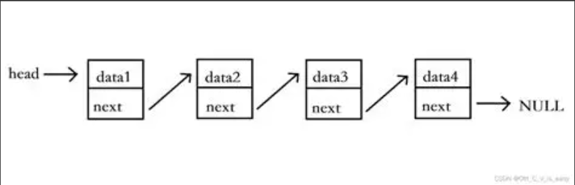
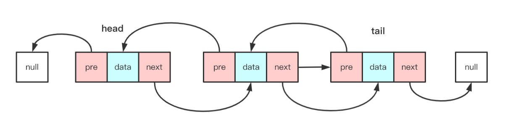
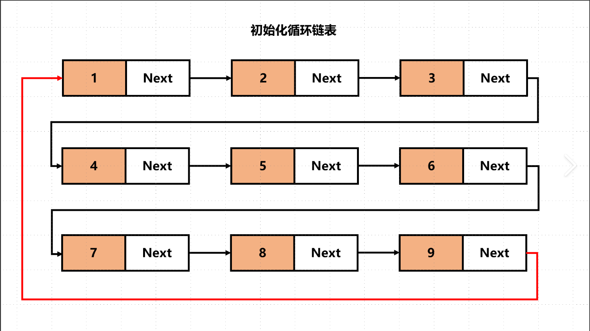

## 数据结构
[一维数组](../../Csharp基础/数组/一维数组.md) [泛型栈和队列](泛型栈和队列.md) 
数据结构
数据结构是计算机存储 **组织数据的方式**(规则)
数据结构是指互相之间存在一种或多种特定关系的数据元素的集合
比如自定义的一个 类 也可以称为一只数据结构 自己定义的数据组合规则

不必把数据结构想的太复杂
简单理解 就是人**定义的 存储**数据 和 表示**数据之间关系 的规则**

**常用的数据结构**(前辈总结和制定的一些经典规则)
数组 栈 队列 链表 树 图 堆 散列表 

### 线性表
线性表是一种数据结构 是由n个具有相同特性的数据元素的有限序列
比如`数组` `ArrayList` `Stack` `Queue` `链表`等等

### 顺序存储
`数组` `Stack` `Queue` `List` `ArrayList` ----顺序存储
只是数组 `Stack` `Queue` 的组织规则不同而已
顺序存储:
用一组地址连续的存储单元依次存储线性表的各个数据元素

### 链式存储
单向链表 双向链表 循环链表 ----链式存储
链式存储(链接存储)
用一组任意的存储单元存储线性表中的各个数据元素

#### 单向链表

```C#
    /// <summary>
    /// 单向链表
    /// </summary>
    /// <typeparam name="T"></typeparam>
    class LinkedNode<T>
    {
        public T value;
        //这个存储下一个元素是谁 相当于隐形的箭头
        public LinkedNode<T> nextNode;
        public LinkedNode(T value)
        {
            this.value = value;
        }
    }
```

```C#
/// <summary>
/// 单向链表 管理 节点 管理添加删除等等
/// </summary>
/// <typeparam name="T"></typeparam>
class LindedList<T>
{
    //头部
    public LinkedNode<T> head;
    //尾部
    public LinkedNode<T> last;
    //添加
    public void Add(T value)
    {
        //添加节点 必定是new一个新的节点
        LinkedNode<T> node = new LinkedNode<T>(value);
        if (head == null)
        {
            head = node;
            last = node;
        }
        else
        {
            last.nextNode = node;
            last = node;
        }
    }
    public void Remove(T value)
    {
        if (head == null)
        {
            return;
        }
        //如果删除的是头部(第一个)
        if (head.value.Equals(value))
        {
            //就自己直接等于下一个
            head = head.nextNode;
            //如果头部节点 被移除 发现头部节点变空
            //说明只有一个节点 那尾也要清空
            if (head == null)
            {
                last = null;
            }
            return;
        }
        //删除其他
        LinkedNode<T> node = head;
        while (node.nextNode != null)
        {
            if (node.nextNode.value.Equals(value))
            {
                //让当前找到的这个元素的 上一个节点
                //指向 自己的下一个节点
                node.nextNode = node.nextNode.nextNode;
                break;
            }
            node = node.nextNode;
        }
    }
}
```

```C#
LindedList<int> link = new LindedList<int>();
link.Add(1);//添加
link.Add(2);
link.Add(3);
link.Add(4);
link.Add(5);
//遍历
LinkedNode<int> node = link.head;
while (node != null)
{
    Console.WriteLine(node.value);
    node = node.nextNode;
}
Console.WriteLine("----华丽分割线-----");
//删除(移除)
link.Remove(4);
node = link.head;
while (node != null)
{
    Console.WriteLine(node.value);
    node = node.nextNode;
}
```

#### 双向链表 [练习](#练习)  [Linkedlist](Linkedlist.md)


#### 循环链表



### 顺序存储和链式存储的优缺点
从增删查改的角度思考
增: 链式存储 计算上 优于顺序存储 (中间插入时链式不用像顺序一样去移动位置)
删: 链式存储 计算上 优于顺序存储 (中间删除时链式不用像顺序一样去移动位置)
查: 顺序存储 使用上 优于链式存储 (数组可以直接通过下标得到元素 链式需要遍历)
改: 顺序存储 使用上 优于链式存储 (数组可以直接通过下标得到元素 链式需要遍历)

---

## 练习

尝试自己实现一个双向链表
并提供以下方法和属性
数据的个数 头节点 尾节点
增加数据到链表最后
删除指定位置节点
```C#
class LinkedNode<T>
{
    public T value;
    /// <summary>
    /// 上一个节点
    /// </summary>
    public LinkedNode<T> frontNode;
    /// <summary>
    /// 下一个节点
    /// </summary>
    public LinkedNode<T> nextNode;

    public LinkedNode(T value)
    {
        this.value = value;
    }
}

class LinkedList<T>
{
    //长度
    private int count = 0;
    //第一个
    private LinkedNode<T> head;
    //最后一个
    private LinkedNode<T> last;
    //不能修改
    public int Count
    {
        get { return count; }
    }
    public LinkedNode<T> Head
    {
        get {return head; }
    }
    public LinkedNode<T> Last
    {
        get {return last; }
    }

    //添加
    public void Add(T value)
    {
        //新加节点
        LinkedNode<T> node = new LinkedNode<T>(value);
        if (head == null)
        {
            head = node;
            last = node;
        }
        else
        {
            //添加到尾部
            last.nextNode = node;
            //尾部添加的节点 记录自己的上一个节点是
            node.frontNode = last;
            //让当前新加的变成最后一个节点
            last = node;
        }
        //加了一个节点
        count++;
    }
    public void RemoveAt(int index)
    {
        if (index >= count || index < 0)
        {
            Console.WriteLine("只有{0}个节点 请输入合法位置",count);
            return;
        }
        int tempCount = 0;
        LinkedNode<T> tempNode = head;
        while (true)
        {
            //找到了对应位置节点 然后移除即可
            if (tempCount == index)
            {
                //当前要移除的节点的上一个节点 指向自己的下一个节点
                if (tempNode.frontNode != null)
                {
                    tempNode.frontNode.nextNode = tempNode.nextNode;
                }
                //当前要移除的节点的下一个节点 指向自己的上一个节点
                if (tempNode.nextNode != null)
                {
                    tempNode.nextNode.frontNode = tempNode.frontNode;
                }
                //如果是头部节点 那需要改变节点的指向
                if (index == 0)
                {
                    //如果节点被移除 那头节点就变成了头节点的下一个
                    head = head.nextNode;
                }
                //如果是尾部节点
                else if (index == count - 1)
                {
                    //如果尾节点被移除了 那尾节点就变成了尾节点的上一个
                    last = last.frontNode;
                }
                //改变长度
                count--;
                break;
            }
            //每次循环玩后 要让当前临时节点 等于下一个节点
            tempNode = tempNode.nextNode;
            tempCount++;
        }
    }
```

```C#
LinkedList<int> link = new LinkedList<int>();
link.Add(1);
link.Add(2);
link.Add(3);
link.Add(4);
Console.WriteLine(link.Count);
LinkedNode<int> node = link.Head;
//正遍历
while (node != null)
{
    Console.WriteLine(node.value);
    node = node.nextNode;
}
Console.WriteLine("-----华丽分割线-----");
//反遍历
node = link.Last;
while (node != null)
{
    Console.WriteLine(node.value);
    node = node.frontNode;
}

Console.WriteLine("-----移除-----");
//移除
link.RemoveAt(6);
node = link.Head;
//正遍历
while (node != null)
{
    Console.WriteLine(node.value);
    node = node.nextNode;
}
Console.WriteLine("-----华丽分割线-----");
//反遍历
node = link.Last;
while (node != null)
{
    Console.WriteLine(node.value);
    node = node.frontNode;
}
```